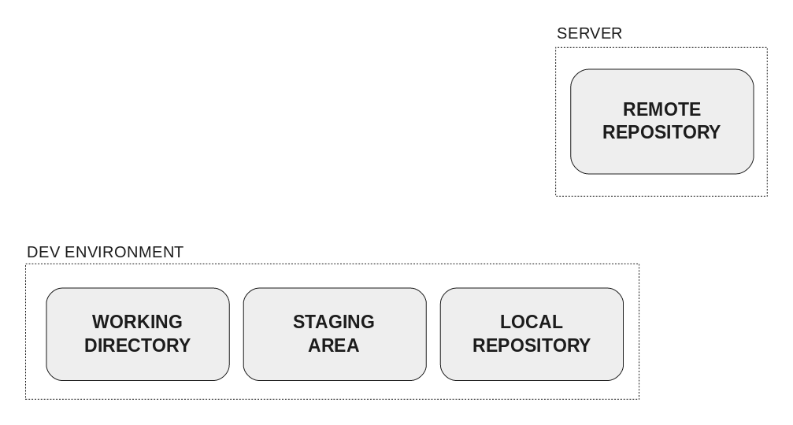
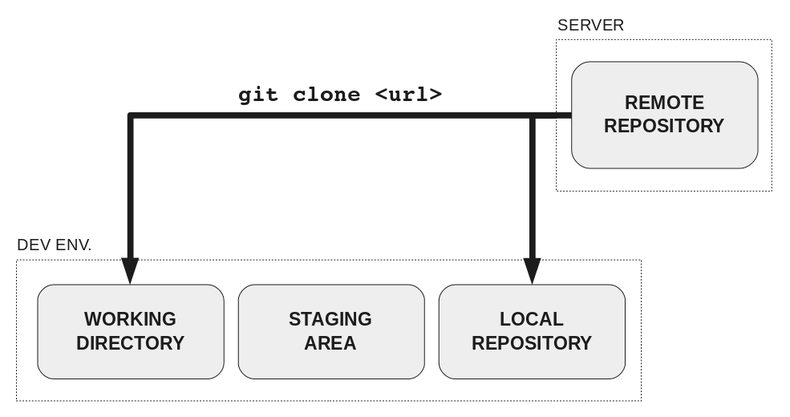
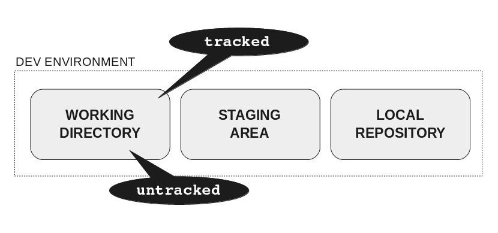
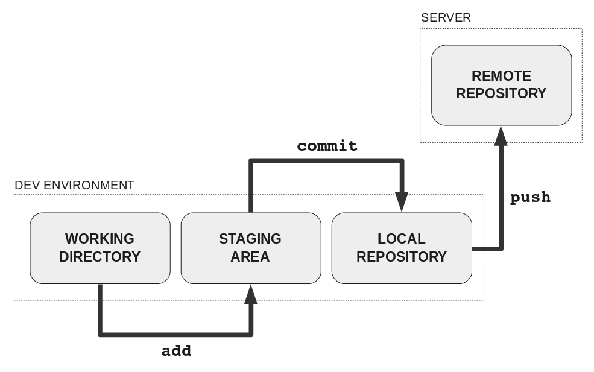
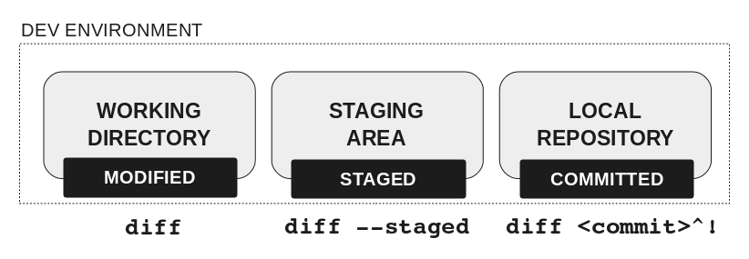

autoscale: true

# Git and GitHub

---

# What is version control?

Version control is a tool that allows you to:

**Collaborate.** Write code (or any kind of document) with other people.

**Track and revert changes.** Mistakes happen. Wouldn't it be nice if you could see the changes that have been made and go back in time to fix something that went wrong?

---

# You already manage versions of your work!

Do you have files somewhere that look like this?

```
Resume­September2017.docx
Resume­for­Duke­job.docx
ResumeOLD.docx
ResumeNEW.docx
ResumeFINAL.docx
ResumeREALLYFINAL.docx
```

**You invented your own version control!**

---

# Git basics

We are going to be talking through a very slimmed down version of what you can do with Git today. Git is a power tool.

---

# What do we want to do with Git?

We want to track changes in our files and put them on GitHub so we can see them online.

---

# How does Git work?



We have two repositories we care about: one on our computer and one on GitHub.

---

# Vocab

* **Repository**: A collection of files and their changes
* **Working directory**: A directory on your computer that contains a repository, will contain a directory named `.git/`
* **Staging area**: A Git-specific concept -- a way for it to set up which changes will be committed
* **Commit**: One set of changes

---

# How to get a copy of a repo on GitHub



---

# Making changes

There are 2 types of files in the working directory:

* **Tracked**: files that Git knows about.
* **Untracked**: files that have still not been added, so Git doesn’t know about.



---

# Committing changes



---

# Committing changes

As changes are ready in the working directory, they must be added in the staging area.

When there is a set of changes with a single purpose in the staging area, you can create a commit with a message in the local repository.

When there are one or several commits in the local repository ready to be shared with the rest of the world, they must be pushed to the remote repository.


---

# See your changes



---

# Remember this workflow

1. add
2. commit
3. push

Write this down on a sticky note!
